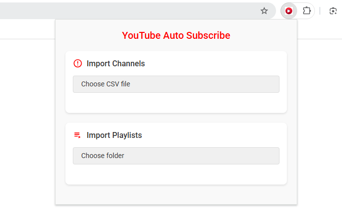

  

This tool allows you to automatically subscribe to YouTube channels from a backup CSV file

making it easy to migrate your subscriptions from an old account to a new one.

## How to Use

### Migrate subscriptions

**Backup Your YouTube Data:**

- Use Google Takeout to export the YouTube history data from your old account.

Follow these steps to transfer your YouTube subscriptions:

1. **Locate the Subscriptions CSV File:**

   - Find the CSV file that contains your subscription information.

2. **Install the Extension:**

   If you can access the Chrome Web Store, you can directly install the [extension](https://chromewebstore.google.com/detail/youtube-auto-subscribe/pgidfiofpgjbnfnjfplkloacifhfnomi).

   If you cannot access the Chrome Web Store, follow these steps:

   > - Go to [Chrome Extensions](chrome://extensions/)  in your browser.
   >
   > - Enable "Developer mode" in the top right corner.
   >
   > - Click on "Load unpacked" and select the folder where you cloned this repository.

3. **Select the CSV File:**

   - Open the YouTube website.
   - Click on the extension icon in the Chrome toolbar.
   - Choose the path to the CSV file containing your subscriptions.

   

4. **Start the Script:**
   - Wait for the script to execute and subscribe to the channels listed in the CSV file.

### Migrate Playlists

This feature allows you to restore your YouTube playlists from backup CSV files.

#### Steps:
1. Click "Choose folder" and select the folder containing playlist backup files
   - Files should be named as `playlist-name-videos.csv`
   - Each CSV file represents one playlist
   - The script will automatically filter for files ending with `-videos.csv`

2. Wait for the process to complete
   - You can minimize the browser but keep it open
   - A notification will appear when all playlists are processed

## Notes

- Ensure that you are logged into your new YouTube account before running the script.
- The script may take some time depending on the number of subscriptions being processed.
- **Make sure the YouTube webpage is set to English or Chinese.**

## Troubleshooting

- If you encounter any issues, check the console for error messages and ensure that the CSV file is formatted correctly.
- For any further assistance, feel free to reach out via [Issue](https://github.com/looechao/YoutubeAutoSubscribe/issues).
